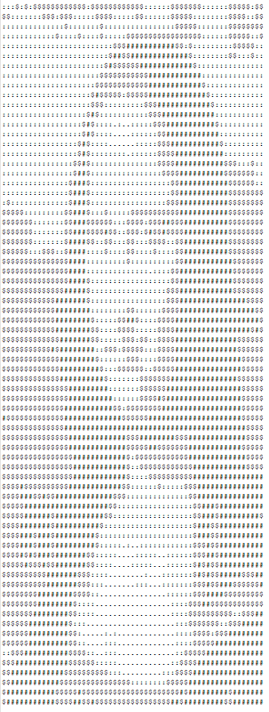
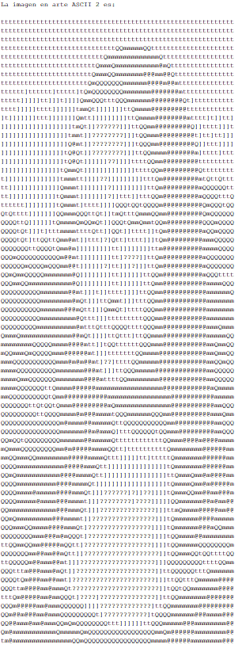
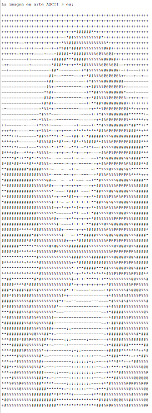
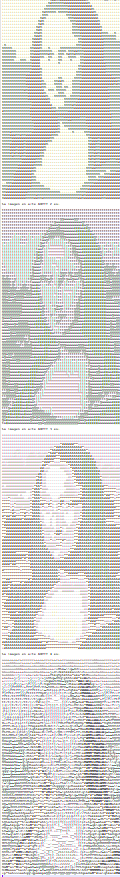

# MP Trabajo final
Proyecto realizado en grupo. En el que hacemos varios tratamientos de imágenes .pgm para aprender a usar memoria dinámica en c++.

Encontramos 3 ejecutables en este proyecto:

-Test Imagen:
  Crea una imagen degradada y hace un recorte a otra imagen previamente introducida.
-Test Morphing: 
  Transforma poco a poco una imagen en otra.
-Test Arte ASCII:
  Transformamos una imagen pequeña .pgm en codigo ascii mediante una funcion definida, encuento a los carácteres usados tenemos 4 variantes:

ASCII 1 : #$:.  

ASCII 2 : @mQt]?'  

ASCII 3 : @%#*+=-:.  

ASCII 4 : $@B%8&WM#*oahkbdp\qwmZO0QLCJUYXzcvunxrjft/|()1{}[]?-_+<>i!lI;:,"^'`.  

Si alejamos las imagenes: 

